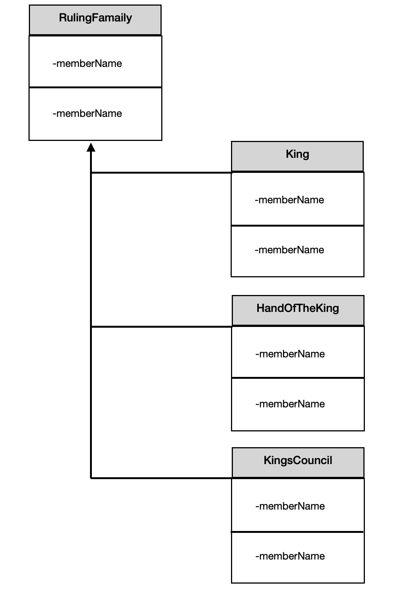

# 추상 팩토리

객체의 구체적인 유형을 모른 채 객체의 kit 를 생성하는 방법.

## 예제: 왕국 시스템

한 사람(왕)이 다스리기에 왕국은 너무 커서 왕은 2인자(hand of the king) 에게 그의 권한 일부를 전가한다.
왕은 또한 영리한 영주들로 구성된 의회(council) 의 조언도 듣는다.

위에서 설명한 클래스의 다이어그램을 나타내면 다음과 같다.



문제는 지배 가문이, 심지어 왕좌에 올라있는 지배 가문 조차도 너무 자주 바뀐다는 것이다. 따라서 다른 가문을
결합시키면 애플리케이션이 유연하지 못하게 된다. 유연하지 못한 애플리케이션은 끊임없이 변화하는 세계에서
살아남기 힘들다.

추상 팩토리 (Abstract Factory) 패턴을 사용하면 이 문제를 해결할 수 있다. 추상 팩토리 패턴은 지배 가문과 관련된
다양한 클래스를 생성할 수 있는 `인터페이스`를 선언한다.

추상 팩토리 클래스는 다양한 지배 가문 각각에 대한 다양한 구현이 가능하다. 이것은 구체 팩토리(Concrete factory)
로 알려져 있는데 추상 팩토리에서 제공된 인터페이스를 구현한다. 구체 팩토리는 다양한 지배 클래스의 구현을 반환한다.
이 구체 클래스들은 제품(product) 으로 알려져 있다.

## 구현

추상 팩토리 패턴의 구현을 위해 가장 먼저 할 일은 King 클래스의 구현이다.

```javascript
var KingJoffery = (function() {
    function KingJoffery() {
    }

    KingJoffery.prototype.makeDecision = function () {
        // ...
    };

    KingJoffery.prototype.marry = function () {
        // ...
    };

    return KingJoffery;
})();
```

이것은 정규 구체 클래스(regular concrete class) 로 어떤 세부 구현 사항도 포함할 수 있다. 유사하게 HandOfTheKing 
클래스도 구현해야 한다.

```javascript
var LordTywin = (function () {
    function LordTywin() {
    }

    LordTywin.prototype.makeDecision = function () {
        // ...
    };

    return LordTywin;
})();
```

구체 팩토리 메소드는 다음과 같다.
```javascript
var LannisterFactory = (function () {
    function LannisterFactory() {
    }

    LannisterFactory.prototype.getKing = function () {
        return new KingJoffery();
    };

    LannisterFactory.prototype.getHandOfTheKing = function () {
        return new LordTywin();
    };

    return LannisterFactory;
})();

```

코드는 단순히 필요한 각 클래스의 새로운 인스턴스를 생성하고 이를 반환한다. 다른 지배 가문의 구현도 동일한
일반적은 양식을 따른다.

```javascript
var TargaryenFactory = (function() {
    function TargaryenFactory() {

    }

    TargaryenFactory.prototype.getKing = function() {
        return new KingAerys();
    };
    
    TargaryenFactory.prototype.getHandOfTheKing = function() {
        return new LordConnington();
    };
    
    return TargaryenFactory;
})();
```

자바스크립트에서 추상 팩토리 패턴의 구현은 다른 언어에 비해 훨씬 쉽다. 하지만 컴파일러 검사를 할 수 없다는
단점이 있다. 정적인 언어로 구성된 패턴은 훨씬 간단하지만 런타임 오류가 발생할 위험성이 있다. 적절한 단위 테스트나
자바스크립트 컴파일러가 이 상황을 개선시킬 수 있다.

추상 팩토리 패턴은 사용하려면, 지배 가문을 필요로 하는 클래스가 필요하다.

```javascript
var CourtSession = (function () {
    function CourtSession(abstractFactory) {
        this.abstractFactory = abstractFactory;
        this.COMPLAINT_THRESHOLD= 10;
    }

    CourtSession.prototype.complaintPresented = function (complaint) {
        if (complaint.severity < this.COMPLAINT_THRESHOLD) {
            this.abstractFactory.getHandOfTheKing().makeDecision();
        } else {
            this.abstractFactory.getKing().makeDecision();
        }
    };

    return CourtSession;
})();
```

이제 CourtSession 클래스를 호출하고 전달하는 팩토리에 따라 다양한 기능을 삽입할 수 있다.

```javascript
var courtSession = new CourtSession(new TargaryenFactory());
courtSession.complaintPresented({severity: 8});
courtSession.complaintPresented({severity: 12});

var courtSession2 = new CourtSession(new LannisterFactory());
courtSession2.complaintPresented({severity: 8});
courtSession2.complaintPresented({severity: 12});
```

정적 언어와 자바스크립트의 차이점에도 불구하고, 이 패턴은 자바스크립트 애플리케이션에 적용 가능하고 유연하다.
객체를 함께 동작할 수 있도록 키트로 생성하면 기능 제공을 위해 객체들 간 협력이 필요하지만, 대규모의 변경이
필요한 경우와 같은 여러 상황에서 유용하다. 또한 여러 객체들이 대체 없이 같이 사용돼야 하는 경우에도 유용한 패턴이다.

---
참조

[자바스크립트 디자인 패턴](http://www.yes24.com/Product/Goods/29390656?OzSrank=1)

[Programming Note](https://dev-momo.tistory.com/entry/추상-팩토리-패턴-Abstract-Factory-Pattern)
